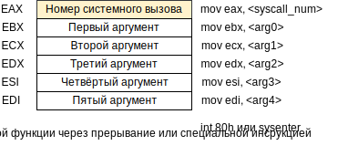

# Linux Assembler x86

## Виртуальное адресное пространство Linux-процесса


## Соглашения о вызовах

Описывают способы:

- вызова функций и возврата из них, 
- передачи параметров в функции и результатов вычислений из них.

| Соглашение                 | Передача аргументов                                          | Очищает стек от аргументов | Возврат результата                                           | Примечание                                                   |
| -------------------------- | ------------------------------------------------------------ | -------------------------- | ------------------------------------------------------------ | ------------------------------------------------------------ |
| **cdecl**                  | Через стек, справа налево                                    | Вызывающая функция         | Числа с плавающей точкой - через регистр `ST0`, целые - через аккумулятор, структура - через  указатель в аккумуляторе | Аргументы, размером < 4 байт, расширяются до 4. Выравнивание стека - 16 байт |
| **pascal**                 | Через стек, слева направо                                    | Вызываемая функция         | Через неявно объявленный Result -  "нулевой" аргумент вызываемой функции | Изменяемые параметры передаются только по ссылке             |
| **stdcall** (winapi)       | Через стек, справа налево                                    | Вызываемая функция         | Аналогично **cdecl**                                         | Аналогично **cdecl**                                         |
| **thiscall** (C++)         | Через стек, справа налево                                    | Вызываемая функция         | Аналогично **cdecl**                                         | Аналогично **cdecl** + параметр **this** передаётся через счётчик *(MVC++)* или через "нулевой" аргумент вызываемой функции (GCC) |
| **fastcall**               | Через регистры слева направо: `ECX/CX/CL`, `EDX/DX/DL`. Остальные через стек справа налево | Вызываемая функция         | Аналогично **cdecl**                                         | Аналогично **cdecl**                                         |
| **register** (Borland)     | Через регистры слева направо: `EAX/AX/AL`, `EDX/DX/DL`, `ECX/CX/CL`. Остальные через стек слева направо | Вызываемая функция         | Аналогично **pascal**                                        | Аналогично **pascal**                                        |
| **vectorcall** (Microsoft) | Аналогично **fastcall** и **thiscall**                       | Вызываемая функция         | Аналогично **fastcall** + см. примечание                     | Числа с плавающей точкой передаются через регистры SSE (`XMM`, `YMM`) |

### Пролог перед вызовом

Перед вызовом функции вставляется код, выполняющий:

- сохранение значений регистров, использующихся внутри вызываемой функции *(push <registers>)*,
- запись в стек передаваемых аргументов функции *(push <argument>...)*.

### Пролог после вызова

После вызова и перед выполнением функции вставляется код, выполняющий:

- сохранение базового адреса фрагмента стека вызывающей функции *(push ebp)*,
- создание нового фрагмента стека для вызванной функции путём установки в качестве базового адреса адреса вершины стека *(mov ebp, esp)*,
- выделение стековой памяти для локальных переменных вызванной функции *(sub esp, N)*.

### Эпилог перед возвратом

После выполнения и перед возвратом из функции вставляется код, выполняющий:

- очистку стековой памяти, выделенной под локальные переменные, и удаление фрагмента стека вызванной функции *(mov esp, ebp)*,
- восстановление базового адреса фрагмента стека вызывающей функции *(pop ebp)*,
- передачу управления вызывающей функции с дополнительной очисткой аргументов *(ret M)* или без *(ret)*.

### Эпилог после возврата

После возврата из функции вставляется код, выполняющий:

- очистку стековой памяти, выделенной под передаваемые аргументы *(add esp, M)*, **если она не была очищена вызванной функцией**,
- восстановление значений регистров, сохранённых кодом пролога *(pop <registers>)*.


## Стек во время работы функции

Программа вызвала функцию 1, которая во время своей работы вызвала функцию 2 *(соглашения о вызовах, в которых аргументы передаются не через регистры)*:


### Пример функции и её вызова

Пусть дана программа, вызывающая некоторую функцию `sum()`:

```c
#include <stdio.h>

int sum(int a, short b, char c) {
    int result = a + b;
    return result + c;
}

void main() {
    int d = sum(1, 2, 3);
    printf("%d\n", d);
}
```

Рассмотрим подробнее содержимое стека во время её выполнения:


## Системные вызовы

Системные вызовы *(syscalls)* - способ обращения к функциям операционной системы для доступа к различным ресурсам (файлам, сети, и т. д.). На рисунке приведён способ выполнения системного вызова через интерфейс ядра:



Если у системной функции количество аргументов больше пяти, они кладутся в стек.

Вызов системной функции через интерфейс пользователя выполняется с помощью библиотеки `libc`. В таком случае аргументы передаются через стек, а не через регистры, и вместо выполнения прерывания происходит вызов библиотечной функции.

Таблицу номеров системных вызовов можно найти на [syscalls.kernelgrok.com](https://syscalls.kernelgrok.com/), там же есть описание типов передаваемых аргументов.


# Linux Assembler x86-64

## Виртуальное адресное пространство 64-битного Linux-процесса


## Соглашения о вызовах x86-64

| Соглашение                      | Передача аргументов                                          | Очищает стек от аргументов | Возврат результата                                           | Примечание                                                   |
| ------------------------------- | ------------------------------------------------------------ | -------------------------- | ------------------------------------------------------------ | ------------------------------------------------------------ |
| **System V AMD64 ABI**          | Через регистры слева направо: `RDI/EDI/DI`, `RSI/ESI/SI`, `RDX/EDX/DX/DL`, `RCX/ECX/CX/CL`, `R8/R8D/R8W/R8B`, `R9/R9D/R9W/R9B`, `XMM0–7`. Остальные через стек справа налево | Вызывающая функция         | Числа с плавающей точкой - через регистры `XMM0` и `XMM1`, целые - через аккумулятор, структура - через  указатель в аккумуляторе | Аргументы, размером < 8 байт, расширяются до 8-16 байт. Выравнивание стека - 16 байт. Над вершиной стека находится [red zone](http://alouette.su/page/postroenie-kadra-steka-na-amd64) (128 байт) |
| **Windows x64 ABI** (Microsoft) | Через регистры слева направо:  `RCX/ECX/CX/CL`/`XMM0`, `RDX/EDX/DX/DL`/`XMM1`, `R8/R8D/R8W/R8B`/`XMM2`, `R9/R9D/R9W/R9B`/`XMM3`. Остальные через стек справа налево | Вызывающая функция         | Числа с плавающей точкой - через регистр `XMM0`, целые - через аккумулятор, структура - через  указатель в аккумуляторе | Аргументы, размером < 8 байт, расширяются до 8 байт. Выравнивание стека - 16 байт. Над вершиной стека находится [shadow space](http://alouette.su/page/postroenie-kadra-steka-na-amd64) (32 байта) |
| **vectorcall** (Microsoft)      | Аналогично **Windows x64 ABI** + регистры `XMM0-XMM5`/`YMM0-YMM5` | Вызывающая функция         | Аналогично **Windows x64 ABI** + [некоторая дичь](https://msdn.microsoft.com/en-us/library/dn375768.aspx) | Аналогично **Windows x64 ABI** + [некоторая дичь](https://msdn.microsoft.com/en-us/library/dn375768.aspx) |

<!-- TODO: red zone, shadow space -->

## Системные вызовы x86-64

Так же, как и в x86, в x86-64 номер системного вызова передаётся через аккумулятор, а аргументы - через регистры:


Для интерфейса ядра нельзя передать больше шести аргументов.

Для пользовательского интерфейса порядок аргументов меняется:

- если аргумент умещается в регистр (8 байт), то он передаётся через регистр,
- если не умещается - через стек (должен быть выровнен по 16 байт).

Если аргументов больше шести, они передаюстя через стек. Возвращаемое значение в обоих случаях кладётся в аккумулятор.

Таблицу номеров системных вызовов можно найти на [w3challs.com/syscalls](https://w3challs.com/syscalls/?arch=x86_64), там же есть описание типов передаваемых аргументов.


# Справочники по ассемблеру

http://faydoc.tripod.com/cpu/ - справочник по набору инструкций Intel Pentium (обзор базовой архитектуры).