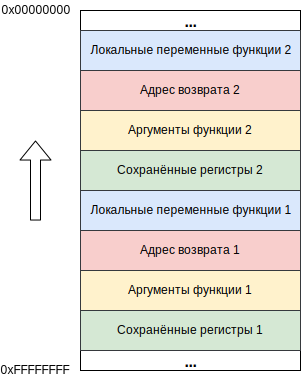

# Linux Assembler x86

## Виртуальное адресное пространство Linux-процесса


## Соглашения о вызовах

Описывают способы:

- вызова функций и возврата из них, 
- передачи параметров в функции и результатов вычислений из них.

| Соглашение                 | Передача аргументов                      | Очищает стек от аргументов | Возврат результата                       | Примечание                               |
| -------------------------- | ---------------------------------------- | -------------------------- | ---------------------------------------- | ---------------------------------------- |
| **cdecl**                  | Через стек, справа налево                | Вызывающая функция         | Числа с плавающей точкой - через регистр `st0`, целые - через аккумулятор, структура - через  указатель в аккумуляторе | Аргументы, размером < 4 байт, расширяются до 4 |
| **pascal**                 | Через стек, слева направо                | Вызываемая функция         | Через неявно объявленный Result -  "нулевой" аргумент вызываемой функции | Изменяемые параметры передаются только по ссылке |
| **stdcall** (winapi)       | Через стек, справа налево                | Вызываемая функция         | Аналогично **cdecl**                     | Аналогично **cdecl**                     |
| **thiscall** (C++)         | Через стек, справа налево                | Вызываемая функция         | Аналогично **cdecl**                     | Аналогично **cdecl** + параметр **this** передаётся через счётчик *(MVC++)* или через "нулевой" аргумент вызываемой функции (GCC) |
| **fastcall**               | Через регистры слева направо: ECX/CX/CL, EDX/DX/DL. Остальные через стек справа налево | Вызываемая функция         | Аналогично **cdecl**                     | Аналогично **cdecl**                     |
| **register** (Borland)     | Через регистры слева направо: EAX/AX/AL, EDX/DX/DL, ECX/CX/CL. Остальные через стек слева направо | Вызываемая функция         | Аналогично **pascal**                    | Аналогично **pascal**                    |
| **vectorcall** (Microsoft) | Аналогично **fastcall** и **thiscall**   | Вызываемая функция         | Аналогично **fastcall** + см. примечание | Числа с плавающей точкой передаются через регистры SSE (XMM, YMM) |

### Пролог перед вызовом

Перед вызовом функции вставляется код, выполняющий:

- сохранение значений регистров, использующихся внутри вызываемой функции *(push <registers>)*,
- запись в стек передаваемых аргументов функции *(push <argument>...)*.

### Пролог после вызова

После вызова и перед выполнением функции вставляется код, выполняющий:

- сохранение базового адреса фрагмента стека вызывающей функции *(push ebp)*,
- создание нового фрагмента стека для вызванной функции путём установки в качестве базового адреса адреса вершины стека *(mov ebp, esp)*,
- выделение стековой памяти для локальных переменных вызванной функции *(sub esp, N)*.

### Эпилог перед возвратом

После выполнения и перед возвратом из функции вставляется код, выполняющий:

- очистку стековой памяти, выделенной под локальные переменные, и удаление фрагмента стека вызванной функции *(mov esp, ebp)*,
- восстановление базового адреса фрагмента стека вызывающей функции *(pop ebp)*,
- передачу управления вызывающей функции с дополнительной очисткой аргументов *(ret M)* или без *(ret)*.

### Эпилог после возврата

После возврата из функции вставляется код, выполняющий:

- очистку стековой памяти, выделенной под передаваемые аргументы *(add esp, M)*, **если она не была очищена вызванной функцией**,
- восстановление значений регистров, сохранённых кодом пролога *(pop <registers>)*.


## Стек во время работы функции

Программа вызвала функцию 1, которая во время своей работы вызвала функцию 2 *(соглашения о вызовах, в которых аргументы передаются не через регистры)*:



### Пример функции и её вызова

Пусть дана программа, вызывающая некоторую функцию `sum()`:

```c
#include <stdio.h>

int sum(int a, short b, char c) {
    int result = a + b;
    return result + c;
}

void main() {
    int d = sum(1, 2, 3);
    printf("%d\n", d);
}
```

Рассмотрим подробнее содержимое стека во время её выполнения:


## Системные вызовы

Системные вызовы *(syscalls)* - способ обращения к функциям операционной системы для доступа к различным ресурсам (файлам, сети, и т. д.).


Если у системной функции количество аргументов больше пяти, они кладутся в стек.

Таблицу номеров системных вызовов можно найти на [syscalls.kernelgrok.com](https://syscalls.kernelgrok.com/), там же есть описание типов передаваемых аргументов.


## Справочники по ассемблеру

http://faydoc.tripod.com/cpu/ - справочник по набору инструкций Intel Pentium (обзор базовой архитектуры).