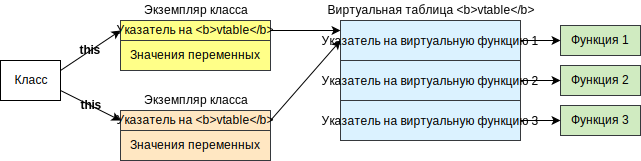

# C++ классы и виртуальные таблицы

**Виртуальная таблица** (**vtable**, VTBL, VMT или *таблица виртуальных методов*) нужна для хранения адресов виртуальных методов (функций).

**Виртуальная функция** - функция, определяемая во время выполнения программы. Другими словами, адрес виртуальной функции определяется непосредственно в момент её вызова.

Обычно виртуальная таблица представляет собой массив адресов, однако может встретится и связный список, элементы которого содержат ещё и указатель на следующий элемент списка и могут быть разбросаны по "всему" исполняемому файлу.

Экземпляры объектов одного и того же класса обычно используют одну и ту же виртуальную таблицу, однако некоторые компиляторы помещают в каждый модуль (*объектный файл*) копию виртуальной таблицы, а компоновщик эти копии не удаляет (или удаляет, но не все) и тупо пихает их в исполняемый файл, что немного усложняет анализ. (*Подробнее см. Крис Касперски - "Искусство дизассемблирования", гл. 13*)




## Простой C++ класс

В простом случае класс содержит переменные и методы, которые могут работать с этими переменными, например:

```c++
class A
{
private:
    int number;

    int get_number() {
        return this->number;
    }

public:
    A() {
        this->number = 1; 
    }
    
    int get() {
        return this->get_number();
    }
};
```

при создании экземпляра класса будет выделена память размером 4 байта под переменную `number`. Здесь ничего интересного нет.


## Производный C++ класс

Производный класс имеет доступ к членам базового класса, например:

```c++
class A
{
private:
    char *s;

    int get_number() {
        return 1;
    }

public:
    A() {
        this->s = "This is string!"; 
    }

    int get() {
        return this->get_number();
    }
};
 
class B: public A
{
private:
    int number;

public:
    B() {
        this->number = 2;
    }
};

int main() {
    B *b = new B();
    std::cout << b->get() << std::endl;
    return 0;
}
```

при создании экземпляра класса `B` будет выделена память размером 8 байтов под переменные `s` и  `number` (несмотря на то, что `s` не используется).

При инициализации объекта сначала в эту память будут записаны значения переменных базового класса, а потом - производного:

```c++
Вызов B::B()
	Вызов A::A()
		Установка значений переменных класса A
		Возврат из A::A()
	Установка значений переменных класса B
	Возврат из B::B()
```


## Класс с виртуальными методами

Если в классе есть хотя бы один виртуальный метод, будет создана виртуальная таблица, хранящая адреса виртуальных методов. Например:

```c++
class A
{
private:
    char *s;

public:
    A() {
        this->s = "This is string!"; 
    }

    virtual int get_number() {
        return 1;
    }
     
    int get() {
        return this->get_number();
    }
};
 
class B: public A
{
private:
    int number;

public:
    B() {
        this->number = 2;
    }

    int get_number() {
        return this->number;
    }
};
```

при создании `b` - экземпляра класса `B`, будет выделена память размером 12 байтов под указатель `vpointer` на виртуальную таблицу `vtable`, переменные `s` и  `number`:

```assembly
0x09883008: vpointer
0x0988300C: s
0x09883010: number
```

 где `0x09883008` - адрес созданного объекта в памяти.

При инициализации объекта `b` в эту память сначала записывается адрес виртуальной таблицы, а потом значения переменных:

```c++
Вызов B::B()
1)	Вызов A::A()
		Запись адреса виртуальной таблицы класса A
		Установка значений переменных класса A
2)		Возврат из A::A()
	Запись адреса виртуальной таблицы класса B
	Установка значений переменных класса B
3)	Возврат из B::B()
```

Рассмотрим на этом примере изменение памяти поэтапно:

1. Изначально в памяти записаны нули:

   ```assembly
   0x09883008: 00000000
   0x0988300C: 00000000
   0x09883010: 00000000
   ```

2. После выполнения конструктора `A::A()` значения в памяти приобретают вид:

   ```assembly
   0x09883008: 08048960
   0x0988300C: 08048934
   0x09883010: 00000000
   ```

   где:

   > `0x08048960` - адрес виртуальной таблицы класса `A`,
   >
   > `0x08048934` - адрес константной строки `"This is string!"`.

3. После выполнения конструктора `B::B()` значения в памяти приобретают вид:

   ```assembly
   0x09883008: 08048950
   0x0988300C: 08048934
   0x09883010: 00000002
   ```

   где:

   > `0x08048950` - адрес виртуальной таблицы класса `B`,
   >
   > `0x08048934` - адрес константной строки `"This is string!"` (значение переменной `char *s`),
   >
   > `0x00000002` - значение переменной `int number`.

### Виртуальные таблицы

Содержимое виртуальной таблицы класса `A`:

```assembly
0x08048960: 0804884A
```

где:

> `0x0804884A` - адрес функции `A::get_number`.

Содержимое виртуальной таблицы класса `B`:

```assembly
0x08048950: 08048892
```

где:

> `0x08048892` - адрес функции `B::get_number`.

При выполнении функции `b->get()` для получения адреса нужной функции `get_number()` будет выполняться разыменование. Затем будет произведён вызов функции:

```c++
func = this->     vtable->   get_number
       0x09883008 0x08048950 0x08048892
func()
```


## Сложный пример

Рассмотрим сложный случай, где:

- производный класс наследует сразу два базовых класса с виртуальными функциями, имена которых конфликтуют между собой;
- в одном из базовых классов содержится чисто виртуальная функция;
- используемый объект инициализируется как экземпляр производного класса, а объявлен как экземпляр одного из базовых классов.

```c++
class A
{
public:
    virtual const char *func() {
        return "A::func";
    }
};

class B
{
public:
    virtual const char *func() {
        return "B::func";
    }

    virtual const char *func_pure() = 0;
};

class C: public A, public B
{
public:
    const char *func() {
        return "C::func";
    }

    const char *func_pure() {
        return "C::func_pure";
    }
}

int main() {
    B *c = new C();
    std::cout << c->func() << std::endl;
    std::cout << c->func_pure() << std::endl;
    return 0;
}
```

при создании `c` - экземпляра класса `C`, будет выделена память размером 8 байтов под указатели  на виртуальные таблицы:

```assembly
0x09006008: vpointer1
0x0900600C: vpointer2
```

 где `0x09006008` - адрес созданного объекта в памяти.

При инициализации объекта `c` в эту память сначала записываются адреса виртуальных таблиц базовых классов `A` и `B`, а потом они перезаписываются адресами виртуальной таблицы производного класса `C` и виртуальной таблицы [переходников](#зачем-нужны-переходники?) этого же класса:

```c++
Вызов C::C()
1)	Вызов A::A()
		Запись адреса виртуальной таблицы класса A
2)		Возврат из A::A()
	Вызов B::B()
		Запись адреса виртуальной таблицы класса B
3)		Возврат из B::B()
	Запись адреса виртуальной таблицы класса C
	Запись адреса виртуальной таблицы переходников класса C
4)	Возврат из C::C()
```

Рассмотрим на этом примере изменение памяти поэтапно:

1. Изначально в памяти записаны нули:

   ```assembly
   0x09006008: 00000000
   0x0900600C: 00000000
   ```

2. После выполнения конструктора `A::A()` значения в памяти приобретают вид:

   ```assembly
   0x09006008: 08048A98
   0x0900600C: 00000000
   ```

   где:

   > `0x08048A98` - адрес виртуальной таблицы класса `A`.

3. После выполнения конструктора `B::B()` значения в памяти приобретают вид:

   ```assembly
   0x09006008: 08048A98
   0x0900600C: 08048A88
   ```

   где:

   > `0x08048A98` - всё тот же адрес виртуальной таблицы класса `A`,
   >
   > `0x08048A88` - адрес виртуальной таблицы класса `B`.

4. После выполнения конструктора `C::C()` значения в памяти приобретают вид:

   ```assembly
   0x09006008: 08048A68
   0x0900600C: 08048A78
   ```

   где:

   > `0x08048A68` - адрес виртуальной таблицы класса `C`,
   >
   > `0x08048A78` - адрес виртуальной таблицы переходников класса `C`.

### Виртуальные таблицы

Содержимое виртуальной таблицы класса `A`:

```assembly
0x08048A98: 080488F6
```

где:

> `0x080488F6` - адрес функции `A::func()`.

Содержимое виртуальной таблицы класса `B`:

```assembly
0x08048A88: 08048900
0x08048A8C: 080486B0
```

где:

> `0x08048900` - адрес функции `B::func()`,
>
> `0x080486B0` - адрес библиотечной функции `__cxa_pure_virtual` или `__purecall`.

Содержимое виртуальной таблицы класса `C`:

```assembly
0x08048A68: 0804890A
0x08048A6C: 0804891C
```

где:

> `0x0804890A` - адрес функции `C::func()`,
>
> `0x0804891C` - адрес функции `C::func_pure()`.

Содержимое виртуальной таблицы переходников класса `C`:

```assembly
0x08048A78: 08048914
0x08048A7C: 08048926
```

где:

> `0x08048914` - адрес функции-переходника на `C::func()`,
>
> `0x08048926` - адрес функции-переходника на `C::func_pure()`.

#### Зачем нужны переходники?

Функция-переходник (*thunk*, *шлюз*) смещает указатель `this` **объекта, который объявлен как экземпляр базового класса, но фактически является экземпляром производного класса**, так, что `this` начинает указывать на экземпляр производного класса (*очевидно, чтобы получить доступ к членам класса, в котором реализована функция*). После смещения указателя `this` она *"прыгает"* на код функции, которая была вызвана. Виртуальная таблица производного класса с функциями-переходниками создаётся для соответствия с виртуальной таблицей базового класса, т. е. функции-переходники создаются только для функций, которые объявлены (*как виртуальные*) в базовом классе. Обобщённо картина памяти имеет следующий вид:


Когда происходит присвоение `B *c = new C();`, компилятор *"понимает"*, что, несмотря на инициализацию всего производного класса `C`, использоваться будут только члены базового класса `B`, поэтому смещает указатель `this` так, чтобы он указывал на начало *"базовой части"* объекта, т. е. на экземпляр базового класса, который содержится в экземпляре производного.

При выполнении функции `c->func()` сначала будет выполняться разыменование относительно виртуальной таблицы переходников, которая заменяет собой виртуальную таблицу базового класса `B`. Затем будет произведён вызов функции-переходника:

```c++
f = this->     thunk_vtable->_func
    0x0900600C 0x08048A78    0x08048914
f()
```

где `_func()` можно описать как:

```assembly
proc func:
    ...
endp

proc _func:
    this = this - 4
    jmp func
endp
```

Подобные вызовы, при которых в виртуальной таблице вместо адреса функции лежит адрес кода, вычисляющий адрес нужной функции, называются **вызовами через шлюз**.

Если заменить строку `B *c = new C();` строкой `C *c = new C();`, функции-переходники всё равно будут созданы, но не будут использоваться, т. к. указатель `this` изначально будет указывать на нужную структуру.

Если исползовать статическое связывание, т. е. создавать объект на стеке:

```c++
int main() {
    C c;
    std::cout << c.func() << std::endl;
    std::cout << c.func_pure() << std::endl;
    return 0;
}
```

все виртуальные таблицы и функции-переходники также будут созданы, но не будут использоваться. Вместо разыменования и вызова функций-переходников будет сразу вызвана нужная функция (*по её смещению*), т. к. компилятор ещё на стадии компиляции узнаёт адрес функции, которая будет вызвана. Исходя из этого можно сделать вывод: если функция вызывается напрямую, но её адрес присутствует в виртуальной таблице, то она является виртуальной.