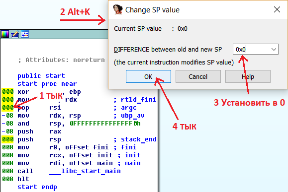

# Ошибки декомпиляции

1. `<адрес>: positive sp value has been found`

   > Не распознан способ работы со стеком. По данному адресу в коде обнаружено положительное смещение (обращение к стеку вне стекового фрагмента функции или *"разбалансировка стека"*).
   >
   > Нужно включить отображение указателя стека в ассемблерном коде `Options` > `General` > `Disassembly` > `Stack pointer`, установить курсор на отображаемое значение стека перед отрицательным значением, нажать `Alt+K` и установить разницу значений `SP` в `<текущая_разница> + <макс_отклонение_от_0>` (в примере `0x8-0x8`, то есть в `0`):
   >
   > 
   >
   > и обновить псевдокод `F5`.

   ​

2. `// local variable allocation has failed, the output may be wrong!`

   > Не распознаны аргументы вызываемых функций.
   >
   > Нужно пройтись по вызовам функций в псевдокоде (пооткрывать вызываемые функции), чтобы Hex-Rays детально их проанализировал, а затем обновить псевдокод `F5`.


# "Закидоны" Hex-Rays

1. `*(_DWORD *)(&v17 + 56)` или `*(_DWORD *)(4 * i + v8)`

   > Не распознан массив. Должно быть: `v17[56]` или `v8[i]`.
   >
   > Нужно **прописать типы** - объявить переменную как указатель (или задать массив).
   > Например как `_DWORD *v8;` вместо `int v8;`.
   >
   > *Примечание:* может появиться запись типа `*a2 = 2 * v5 `, это то же самое, что и `a2[0] = 2 * v5`.

   `*(_DWORD *)(4LL * *(_DWORD *)(4LL * (signed int)i + a2) + a1)`

   > Не распознан массив и индекс в виде значения другого массива. Должно быть: `a1[a2[i]]`.
   >
   > **Аналогично**, нужно обявить переменные как указатели.
   > Например `_DWORD *a1, *a2`.

   ​

2. ```c
   char s;    // [sp+Dh]
   char v5;   // [sp+Eh]
   char v6;   // [sp+Fh]
   char v7;   // [sp+10h]
   size_t v8; // [sp+10Ch]
   // ...
   scanf("%s", &s);
   if (v8 != 6 || s != 113 || v5 != 119 || v6 != 101 || v7 != 114) {
      // ...
   ```

   > Распад переменных в стеке. Должно быть:
   >
   > ```c
   > char s[255]; // [sp+Dh]
   > size_t v8;   // [sp+10Ch]
   > // ...
   > scanf("%s", s);
   > if (v8 != 6 || s[0] != 113 || s[1] != 119 || s[2] != 101 || s[3] != 114) {
   >     // ...
   > ```
   >
   > Нужно **обяъвить первую переменную как массив**.
   > Например, `char s` обявить как `char s[255]`.

   ```c
   if (strlen(&Buf) > 5)
       result = byte_804A04B == 97 && byte_804A049 == 49 && byte_804A04D == 66 && Buf == 99 && byte_804A04A == 52 && byte_804A04C == 101;
   ```

   > Распад глобальных переменных. Должно быть:
   >
   > ```c
   > if (strlen(Buf) > 5)
   >     result = Buf[3] == 97 && Buf[1] == 49 && Buf[5] == 66 && Buf[0] == 99 && Buf[2] == 52 && Buf[4] == 101;
   > ```
   >
   > **Аналогично**.
   > Например, объявить переменную `Buf` как массив.

   ​

3. ```c
   __int64 v4; // [sp+0h]
   __int64 v5; // [sp+8h]
   __int64 v6; // [sp+10h]
   __int64 v7; // [sp+18h]
   __int64 v8; // [sp+20h]

   v4 = 8022916924116329800LL;
   v5 = 8243109180364582002LL;
   v6 = 8749685271133495397LL;
   v7 = 8318822935124340256LL;
   v8 = 58;
   ```

   > Строка распознана как числа. Должно быть:
   >
   > ```c
   > char v4[] = "Hello World, here are my numbers:";
   > ```
   >
   > Нужно поменять тип первой переменной с числа на символ (байт) и **создать массив**, покрывающий остальные числа. Например с `__int64 v4` на `char v4[40]`.

   ​

4. `*(_BYTE *)(i + 134520876) != *(&Buf + i - 1) + i `

   > Адрес переменной не распознан и представлен в виде числа. Должно быть: `*(&Buf + i) != *(&Buf + i - 1) + i`.
   >
   > Нужно переключиться на ассемблерный код, **обозначить число как смещение** (адрес переменной) и обновить псевдокод.

   ​

5. ```c
   v3 = &s;
   do 
   {
       v4 = *(_DWORD *)v3;
       v3 = (__int64 *)((char *)v3 + 4);
       v5 = ~v4 & (v4 - 0x1010101) & 0x80808080;
   } 
   while (!v5);
   v6 = (unsigned __int16)(v5 & 0x8080) == 0;
   if ( !(v5 && 0x8080) )
       v5 >>= 16;
   if ( v6 )
       v3 = (__int64 *)((char *)v3 + 2);
   if ( (char *)v3 + -__CFADD__((_BYTE)v5, (_BYTE)v5) - 3 - (char *)&s == 37 )
   ```

   > Компилятор оптимизировал программу, вставив код вызываемой функции в место её вызова. Должно быть:
   >
   > ```c
   > if (strlen(&s) == 37)
   > ```
   >
   > Нужно ~~плакать~~ запоминать примерный код библиотечных функций и распознавать его глазами.

   Другой пример:

   `if (strcmp(&v8, "test_test_123"))` разворачивается как:

   ```c
   v4 = "test_test_123";
   v5 = 14LL;
   v6 = &v8;
   do
   {
       if ( !v5 )
           break;
       v3 = *(_BYTE *)v6 == *v4;
       v6 = (__int64 *)((char *)v6 + 1);
       ++v4;
       --v5;
   }
   while ( v3 );
   if (v3)
   ```

   ​

6. ```c
   v8 = (unsigned __int8)(((unsigned __int64)(signed int)v8 >> 56) + v8) - ((unsigned int)((unsigned __int64)(signed int)v8 >> 32) >> 24);
   ```

   > Не распознана операция взятия остатка от деления (взятия числа по модулю). Должно быть: `v8 = v8 % 256;`.
   >
   > Опять же, нужно ~~плакать~~ смириться и распознавать такой код глазами, или пытаться загуглить константы, или **юзать [Hacker's Delight](http://www.hackersdelight.org/magic.htm)**.

   Другие примеры:

   `v3 % 13` может быть представлен как:

   ```c
   v3 - 13 * ((unsigned int)((unsigned __int64)(1321528399LL * v3) >> 32) >> 2)
   ```

   `v5 % 64` может быть представлен как: `(_BYTE)v5 & 0x3F`

   ​

7. `JUMPOUT(__CS__, varOrExp);`

   > *Скорее всего* не распознан оператор `switch` . Должно быть:
   >
   > ```c
   > switch (varOrExp) {
   > 	// ...
   > }
   > ```
   >
   > Если ассемблерный код в этом месте выглядит примерно так:
   >
   > ```assembly
   > movsxd rdx, eax
   > lea rax, dword_BA90
   > add rax, rdx
   > jmp rax
   > ;---------------------
   > mov rax, ...
   > ...
   > jmp loc_900F
   > ;---------------------
   > mov rax, ...
   > ...
   > jmp loc_900F
   > ;---------------------
   > ```
   >
   > и по адресу `.rodata`:`0xBA90` лежат числа (`_DWORD dword_BA90[255]`), то можно **вручную объявить `switch`**, поставив курсор на инструкцию `jmp rax`, открыв соответствующее окно: `Edit` > `Other` > `Specify switch idiom...` и задав значения:
   >
   > | Название поля            | Описание                                                     | Значение из примера |
   > | ------------------------ | ------------------------------------------------------------ | ------------------- |
   > | Address of jump table    | Адрес таблицы прыжков (где лежат числа)                      | 0xBA90              |
   > | Number of elements       | Количество `case`'ов                                         | 254                 |
   > | Size of table element    | Размер числа (*в байтах*) в таблице прыжков                  | 4                   |
   > | Element base value       | Базовый адрес, к которому прибавляется значение из таблицы прыжков (`add rax, rdx`) | `rax` = 0xBA90      |
   > | Input register of switch | Название регистра, по которому совершается прыжок            | rax                 |
   >
   > также не забыть поставить галочку на `Signed jump table elements`, если числа в таблице прыжков отрицательные. После этого нужно обновить псевдокод `F5`.

   `JUMPOUT(locret_403CFD);`

   > Не распознан конец функции. Можно попробовать изменить его, перейдя на нужную строку в ассемблере и нажав на `E`. После этого, как обычно, нужно обновить псевдокод `F5`.


